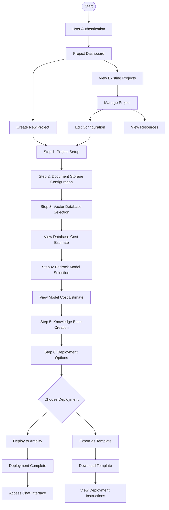

# Document Chat with AWS Bedrock

A React application that allows users to chat with their PDF documents using AWS Bedrock, similar to the functionality available in the AWS Management Console.

## Features

- 📄 Upload PDF documents to Amazon S3
- 🔍 Create knowledge bases with different vector database options
- 💬 Chat with documents using Amazon Bedrock models
- 🔐 User authentication with Amazon Cognito
- 💰 Cost estimation for selected services
- 📊 Compare different vector database options

## Architecture

This application uses the following AWS services:

- **Amazon S3**: Document storage
- **Amazon Bedrock**: AI/ML capabilities for document processing and chat
- **Amazon Cognito**: User authentication and authorization
- **Vector Databases**: Options include Amazon OpenSearch, Aurora with pgvector, DynamoDB, Kendra, or third-party options like Pinecone

## User Flow



## Getting Started

### Prerequisites

- Node.js (v14 or later)
- AWS Account with access to Bedrock, S3, and Cognito
- AWS CLI configured with appropriate permissions

### Installation

1. Clone the repository:

```

git clone https://github.com/yourusername/chatio-aws.git
cd chatio-aws

```

2. Install dependencies:

```

npm install

```

3. Create a `.env` file based on `.env.example` and fill in your AWS configuration:

```

cp .env.example .env

```

4. Start the development server:

```

npm start

```

## AWS Setup

### 1. Create an S3 Bucket

```bash
aws s3 mb s3://your-document-bucket-name --region us-east-1
```

Enable CORS on the bucket:

```json
[
  {
    "AllowedHeaders": ["*"],
    "AllowedMethods": ["GET", "PUT", "POST", "DELETE"],
    "AllowedOrigins": ["http://localhost:3000"],
    "ExposeHeaders": []
  }
]
```

### 2. Create a Cognito User Pool

```bash
aws cognito-idp create-user-pool --pool-name DocumentChatUserPool --region us-east-1
```

Create a User Pool Client:

```bash
aws cognito-idp create-user-pool-client --user-pool-id YOUR_USER_POOL_ID --client-name DocumentChatClient --no-generate-secret --region us-east-1
```

### 3. Set up Bedrock Access

Ensure your AWS account has access to Amazon Bedrock and the models you want to use.

### 4. Configure Vector Database

Follow the AWS documentation to set up your preferred vector database:

- [Amazon OpenSearch Service](https://docs.aws.amazon.com/opensearch-service/latest/developerguide/what-is.html)
- [Amazon Aurora with pgvector](https://docs.aws.amazon.com/AmazonRDS/latest/AuroraUserGuide/postgresql-vectors.html)
- [Amazon DynamoDB](https://docs.aws.amazon.com/amazondynamodb/latest/developerguide/Introduction.html)
- [Amazon Kendra](https://docs.aws.amazon.com/kendra/latest/dg/what-is-kendra.html)

## Backend Setup

For a complete solution, you'll need to deploy a backend API to handle secure communication between your frontend and AWS services. This can be done using:

- AWS Lambda functions
- Amazon API Gateway
- AWS CDK or CloudFormation for infrastructure as code

A sample backend implementation will be provided in a separate repository.

## Cost Optimization

The application includes a cost estimator component that provides approximate costs based on:

- Selected vector database
- Selected Bedrock model
- Estimated document count
- Estimated queries per month

For more accurate pricing, use the [AWS Pricing Calculator](https://calculator.aws).

## Development Notes

### Authentication

For development purposes, the AuthComponent has a DEV_MODE flag that can be set to true to bypass authentication. This allows you to develop and test other components without needing a fully configured Cognito user pool.

When ready to test authentication:

1. Set DEV_MODE to false in AuthComponent.tsx
2. Ensure your Cognito user pool client has the appropriate authentication flows enabled

### Component Structure

- **auth/**: Authentication components
- **document-chat/**: Document upload and chat interface
- **cost-optimizer/**: Vector database selection and cost estimation
- **services/**: AWS service integrations (S3, Bedrock, etc.)
- **config/**: AWS configuration and options

### Incremental Development Approach

For best results when continuing development:

1. Focus on one component at a time
2. Test each component individually before integration
3. Use mock data during early development stages
4. Gradually replace mock implementations with real AWS service calls

## Security Considerations

- Use AWS IAM roles with least privilege
- Implement proper authentication and authorization
- Encrypt data at rest and in transit
- Consider using AWS WAF for additional security

## License

This project is licensed under the MIT License - see the LICENSE file for details.
